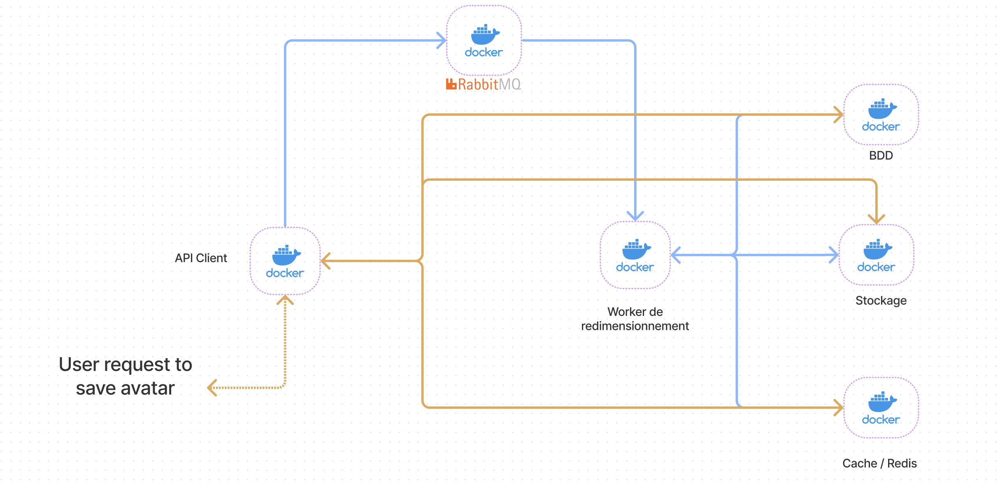
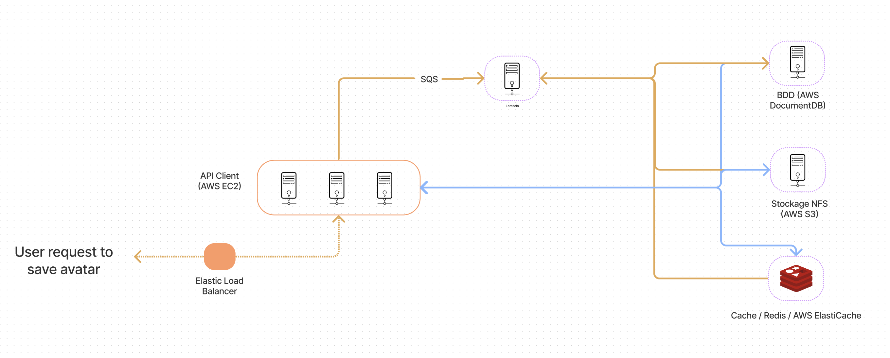

# Avatar resizer

Infrastructure project for HETIC.

## Description

We designed local infrastructure in this project.

### Local infrastructure schema


### Cloud infrastructure schema


### How it works 

1. client sends request to API
2. API stocks image in redis
3. API sends message to rabitMQ
4. worker consumes rabbitMQ message
5. worker crops image & stocks it in a docker volume also shared with API 
6. worker stocks image name in database
7. worker invalidate redis cache

## Conventions

### Commit convention

A commit convention based on Angular commit message guideline. You can find it [here](https://gist.github.com/brianclements/841ea7bffdb01346392c)

To make it quick every commit should look like this :

`<type>(<scope>): <subject>`

A git hook is defined in the .githooks directory to respect a certain commit pattern.

Type should be either feat|fix|doc|add|update|delete.

The developer is free to chose scope and subject.

### Branching convention

We will be using [Gitflow](https://www.atlassian.com/git/tutorials/comparing-workflows/gitflow-workflow) branching workflow.

A git hook is also defined in the .githooks directory to respect a certain branch naming pattern.

You should call your branch feature|bugfix|improvement|release|hotfix|support/branch-subject

## Prerequisites

* make 
* docker 
* docker-compose 

## Start working on project

If you are cloning project for the first time, run
```
make init
```

To setup database, run : 
```
make database
```

To start working on project, run :
```
make dev
```

If you want logs displayed on terminal run :
```
make logs
```

To stop containers, run :
```
make stop
```

To remove containers, run :
```
make remove
```

## Try our project

Use ./postman/collection.json file and import it into your postman app. 

Make sure you change the image in POST request by one you have locally.

You can also run : 

```
make test
```

## Docker

There are 6 containers running.

### API : node:14.17

Available on localhost:3000

#### client connections:

* host: 'api'
* port: 3000

### Worker : node:14.17

Available on localhost:3001

#### client connections:

* host: 'worker'
* port: 3001

### redis:6.2 

For caching. 

#### client connections:

* host: 'redis-server'
* port: 6379
* password: pwd-redis

### rabbitmq:3-management

Go to localhost:15672 and connect with admin credentials if you want to manage/monitor rabbitmq via UI.

#### client connections:

* host: 'beautiful-rabbit'
* port: 5672

Admin user :
* user: admin
* password: rabbitmq-admin

API user :
* user: api-usr
* password: rabbitmq-api-pwd

Worker user : 
* user: worker-usr
* password: rabbitmq-worker-pwd

You can check rabbitmq logs in .docker/rabbitmq/logs

### postgres:13.3

#### client connections:

* host: 'postgres'
* port: 5432
* user: root
* password: root
* db: db

#### adminer:4.8.1

To manage database with a UI, go to localhost:8080
